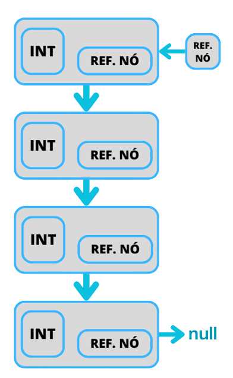
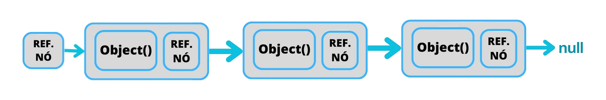

<h1>Estruturas de Dados em Java</h1>

<h2>Pilhas</h2>

<b>LIFO:</b> Last in, First out

Ou seja, o último que entra é sempre o primeiro que sai.

<b>Encadeamento de Nó</b>

<b>Métodos:</b> Top, Push e Pop

<b>Top</b> - Mantém o último elemento(do topo) na pilha. 
Porém ele captura apenas as informações, 
sem realizar qualquer modificação.

<b>Pop</b> - Remove o elemento do topo da pilha.

<b>Push </b>- Insere o elemento no topo da pilha.

<b>isEmpty</b> - Informa verdadeiro ou falso se a pilha estiver vazia.

  
<h2>Filas</h2>

<b>FIFO:</b> First in, First out

Ou seja, primeiro elemento que entra é o primeiro elemento que sai.

 

<b>Encadeamento de Nó</b>

<b>Métodos:</b> Enqueue e Dequeue

<b>Enqueue </b>- O novo elemento entre entre Ref nó (De entrada) e o último Objeto. Ou seja o último da fila.

<b>Dequeue </b>- O método retira o primeiro elemento da fila, imediatamente o segundo apontará para nulo.

<h2>Listas Encadeadas</h2>

<b>Métodos:</b> Add, Remove,get, getNo 
