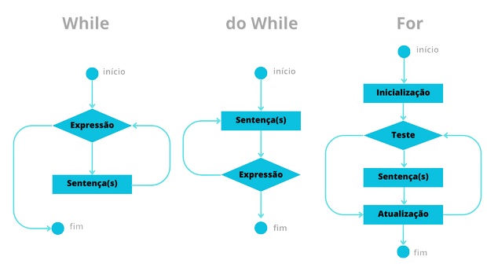

<h1>Estruturas de Repetições</h1>

Uma estrutura de repetição permite que uma sequência de 
comandos seja executada repetidamente, caso determinadas condições são satisfeitas.

As estruturas de repetição podem ser classificadas em:

Repetição com teste no início (while)

Repetição com teste no final (do-while)

Repetição contada (for)

<h2>Exercícios:</h2>

While - Ex1 e Ex2 

Do-while - Ex3 e Ex4

For - Ex5 e Ex6

